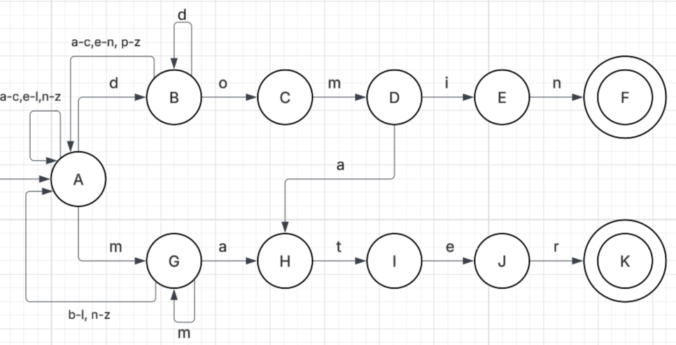

# E1 Lexical Analysis Parser

## Description
In this project, a lexical analysis parser which can correctly detect the following roots in any word with its respective variations has been generated:  

+ *mater*, meaning mother or maternal
+ *domin*, meaning master

Both sets are derived from Latin. This project is meant to design a DFA, or multiple, that will only accept words with those roots, whether it be as a prefix, a suffix, or within the word itself, essentially establishing a language which only accepts words with *domin* or *mater*.

### DFA
The foundation of this project begins with the design of a deterministic finite automaton (DFA), or a "computational device whose input is a string and whose output is one of two
values that we can call *Accept* and *Reject*” (Rich, 2007, pp. 46-50). In other words, a mathematical model often used in programming to identify languages. This is otherwise known as a deterministic finite state machine. An automaton is considered to be deterministic if and only if an input has one single output (A.K.A only one transition state). A DFA will not accept empty strings or strings with a termination that is not an accepted state.

Mathematically, a DFA is a quintuple, where:  

&emsp;&emsp;&emsp;&emsp;&emsp;M = {K, Σ, δ, q0, F} 

Where 

+ **Σ** = input alphabet 
+ **K** = finite set of states 
+ **δ** = Transition function 
+ **q0** is the start state 
+ **F** is the set of accepting states 

### Regular expressions
The implementation of this lexical analysis project will be further explored using regular expressions. Commonly known as Regex, this is typically a combination of characters that aid in the extraction of information within text using pattern matching. While it can also be used to replace, in this project it will be simply used to identify and validate whether *mater* and *domin* are found within the test words. 

## Models
A singular automaton has been designed where depending on the start, the DFA would either identify *domin* or *mater*. This automaton will only accept the following alphabet:   

Σ = *d, o, m, i, n, a, t, e , r*   

 

Important to note that there are fallbacks to prevent the parser from crashing. For example, if there is a word with *mater* but it has double m, there is a way to continue searching. Likewise with *domin*. Similarly, if we start with d or m but the continuation will not lead to the respective roots, the parser is sent to the beginning so as not to completely crash. 

Furthermore, the regular expression generated is the following:

**\w\*mater\w\*|\w\*domin\w\***

## Implementation
### First Implementation
In order to implement this lexical analysis, I have decided to start by using the regular expression generated in python as seen in the regex.py file. In order to use the file, an input in the form of a string is needed and the program will return “The word is part of the language.” if the string is accepted. If the string is not accepted, the program will return “the word is not in the language. Try again”.

The user is able to input as many words as they like until they type “exit” to stop the program. 

Some examples of inputs and output include: 

maternal → the word is part of the language. 

cater → the word is not part of the language. Try again 

dominate → the word is part of the language. 

dominion → the word is part of the language. 

matriarchy → the word is not part of the language. Try again. 

### Second Implementation
For the second implementation, I have decided to create a “simple database” (Sterling & Shapiro, 1986, pp. 19–24) using the automaton generated directly into Prolog in order to validate said DFA. This will be using the automata.pl file, which you must load into your designated prolog terminal.

Unlike the simple function of the regex, the Prolog file requires more detail in construction. To implement the automaton, it is required to establish all the relationships.

**transit(initial_state,next_state,input).**

Once all the relationships are established, as well as any required fallbacks, the accepting states are established. These will be the states where the string of text is accepted into the language because they include *mater* or *domin*.

**accept(accepting_state).**

Prolog needs to recursively parse through the strings entered in order to reach the accepting state (or not in the case of rejects from the language). To do this, a base case is established where once the accepting state is reached, it does not matter if there are letters afterward, the word is accepted into the language. For this, a variable equivalent of *do not care* is written in.

**readString(State,_):- accept(State).**

Before moving on, it is important to establish that the user is inputting words, and in order to go through the strings, the characters must be converted into a list of characters in order to individually check them. Using a specific predicate that takes in the input string and converts it into a list, the program will run through the list of characters and not the single word. This is also where the start state is established.

**parseThru(Word):-  
&nbsp;&nbsp;&nbsp;&nbsp;&nbsp;atom_chars(Word,List),  
&nbsp;&nbsp;&nbsp;&nbsp;&nbsp;readString(a,List).**  

From here, Prolog is able to recursively parse through as long as there are characters to read, figuring out the next transition established. This will be accomplished by dividing the string into its head and tail, individually checking each character.

**readString(State,[Char|Rest]):-  
&nbsp;&nbsp;&nbsp;&nbsp;&nbsp;transit(State,NextState,Char),  
&nbsp;&nbsp;&nbsp;&nbsp;&nbsp;readString(NextState,Rest).**

Important note, there are words that do not begin with the root, which is where the program must restart from the start state, which is always ‘a’ according to the automaton diagram.

**readString(a,[_|Rest]):- readString(a,Rest).**

Once the file has been loaded and the message ***true***. is received, you can begin testing out with the following function:

**parseThru(your test word).**

Some of the inputs and outputs include:

?- parseThru(immaterial). 
true.

?- parseThru(hello). 
false.

?- parseThru(dominion). 
true.

?- parseThru(mathematics). 
false.

## Tests
For further view into testing, the file regex_test.py contains all the cases tested for regular expressions. Additionally, the file automata_test.pl contains all the cases tested for the automaton.

## Analysis
For the regular expression model in python, the time complexity is O(n), meaning it is linear. Since both the roots are static, there is no chance of there being ambiguity or change. Additionally, the input string continues the linear complexity since it is just a single string of characters which are parsed once.

I have decided to import the re library from Python since it allows us to parse the string and match any characters that we are looking for by creating a pattern match sequence.

The following is proof by induction that the regular expression method is linear:

P(n) = n &nbsp;&nbsp;&nbsp;&nbsp;&nbsp;*where n is the length of the string*  
n = 0  &nbsp;&nbsp;&nbsp;&nbsp;&nbsp;&nbsp;&nbsp;&nbsp;&nbsp;*base case*  
P(0) = 0 &nbsp;&nbsp;&nbsp;&nbsp;&nbsp;*empty string, no steps taken*  

n = k  
P(k) = k  
p(k+1) = k+1  

if k = 2  
P(3) = 3 &nbsp;&nbsp;&nbsp;&nbsp;&nbsp;*in a string of three, 3 steps are taken*  

When it comes to a lexical analysis parser, the most natural solution tends to be the creation of an automaton, which similarly will go through the strings input and accept words into the language with the roots. Unfortunately, it takes more work to get all the possible solutions and inputs in order to detect when the root is at the end or within the word to prevent the process from completely ending at whenever the root is not at the beginning of the word.

Either method is linear time complexity, where the regex method may change depending on the pattern used. In this case, I would prefer using the regular expression method since it requires finding the correct pattern match sequence before everything falls into place. Unlike with the automaton, where all relations have to be declared followed by accepting states and so on, the regular expression method simply requires a correctly refined search pattern. 

## References
GeeksforGeeks. (2017, June 28). Pattern matching in Python with Regex. https://www.geeksforgeeks.org/python/pattern-matching-python-regex/  

GeeksforGeeks. (2020, May 16). Difference between DFA and NFA. https://www.geeksforgeeks.org/theory-of-computation/difference-between-dfa-and-nfa/  

Jahan, M. (2024, January 24). Deterministic finite automata. https://www.educative.io/blog/deterministic-finite-automata  

Rich, E. (2007). Automata, Computability and Complexity: Theory and Applications (pp. 46–50). The University of Texas at Austin. https://www.cs.utexas.edu/~ear/cs341/automatabook/AutomataTheoryBook.pdf 

Sterling, L., & Shapiro, E. Y. (1986). The Art of Prolog (pp. 19–24). Massachusetts Institute of Technology.

